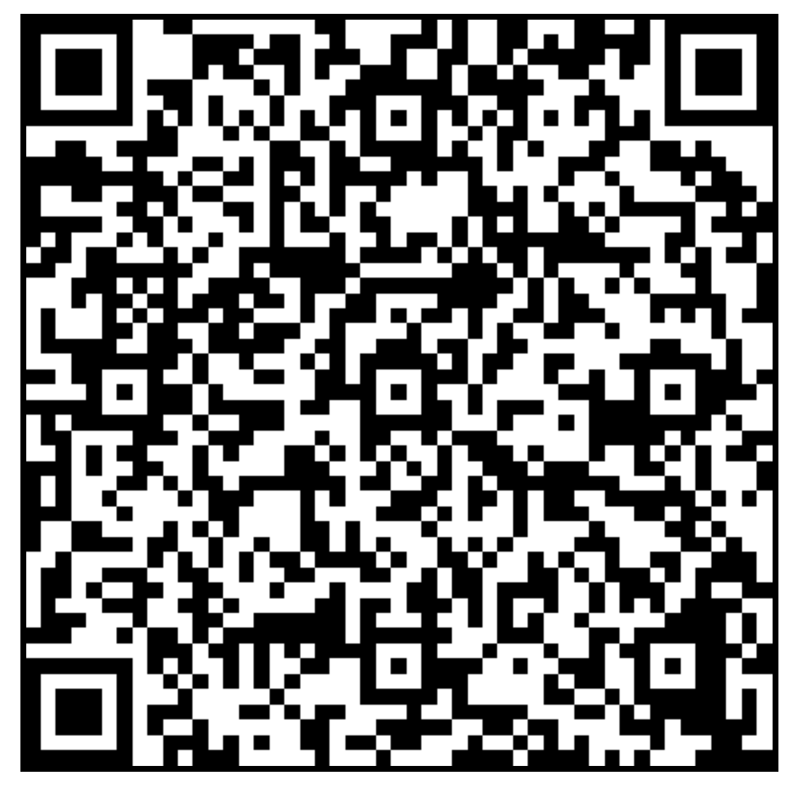

   
# [PIRATE SHIP](https://github.com/LafeLabs/distro/tree/main/PIRATESHIP#readme)

 - EVERYTHING FREE FOR EVERYONE EVERYWHERE RIGHT NOW!
 - NO ONE IS FREE UNTIL EVERYONE IS FREE!
                   
##  PRODUCT OF THE PIRATE SHIP
    
PIRATE SHIPS ARE A COLLECTIVE OF CREATIVE PEOPLE WHO COME TOGETHER TO BUILD AND DISTRIBUTE FREE MEDIA AND INFRASTRUCTURE IN [THIRD SPACES](https://en.wikipedia.org/wiki/Third_place)!

## BUSINESS PLAN

GET THE CREW PAID! GET FREE STUFF TO WHOEVER NEEDS IT! DISTRIBUTE! REPLICATE! MAKE NEW PIRATE SHIPS! SPREAD THE MEMES!

# THE CREW
        
 - CONTENT CREATOR
 - WEB DEVELOPER
 - STEWARD OF THE THIRD SPACE
 - PIRATE CAPTAIN
       
# LAWS OF THE PIRATE SHIP

1. ALL CREW MEMBERS RECEIVE AN EXACTLY EQUAL SHARE OF THE LOOT!
2. ALL PROPERTY IS ABOLISHED IN ON AND AROUND ALL SERVERS!
3. NO PERSONAL INFORMATION OF ANY KIND SHALL BE STORED ON A SERVER!
4. LOGINS AND PASSWORDS ARE ALWAYS PRINTED ON THE SERVER IN LARGE LETTERS ON THE OUTSIDE!
5. ALL SERVERS ARE ALL ART!
6. SERVERS ARE SOURCED FROM WASTE STREAMS!
7. NO NON-FREE SOFTWARE OR MEDIA OF ANY KIND SHALL BE PLACED ON SERVERS!
8. THE WORK ON THE SERVERS IS THAT OF THE CREATORS ENTIRELY, AND WE RELEASE ALL OUR WORK INTO THE PUBLIC DOMAIN!
9. SERVERS ARE DISTRIBUTED FOR FREE IN PUBLIC SHARED SPACES TO WHOEVER NEEDS OR WANTS THEM THE MOST!
10. THE PIRATE CAPTAIN WILL USE AN LLC TO TAKE IN MONEY FROM THE SPONSORS OF THE NETWORK AND DISTRIBUTE TO THE CREW IN AN EXACTLY EVEN SHARE AS 1099 CONTRACTORS, TAKING AN EQUAL SHARE THEMSELVES!
11. NONE OF OUR WEB PAGES WILL EVER PROCESS MONEY, WE USE EXISTING CROWD FUND PLATFORMS TO SUPPORT THE WORK!
12. THE CAPTAIN DECIDES WHO IS ON THE SHIP!
13. THE FINANCES OF THE PIRATE SHIP ARE TOTALLY TRANSPARENT, INCLUDING ALL MONEY FLOWING IN AND OUT, THESE ARE POSTED IN A PERMANENT PUBLIC REPOSITORY!
14. DON'T LIKE THE SHIP? START A NEW SHIP! NOW YOU'RE THE CAPTAIN! DREAD PIRATE ROBERTS! FRICTIONLESS REPLICATION!
